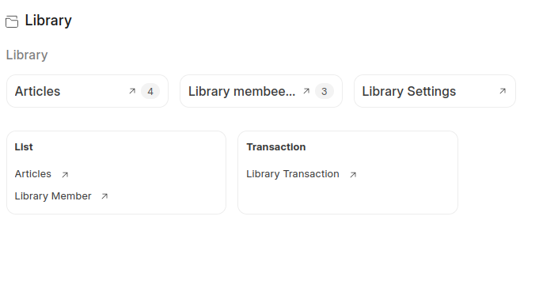
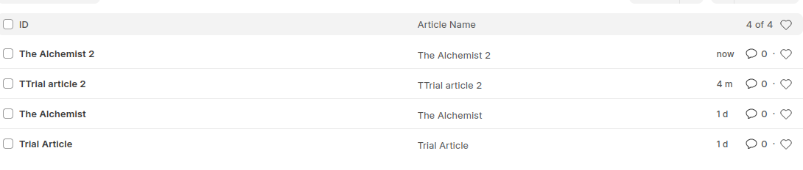
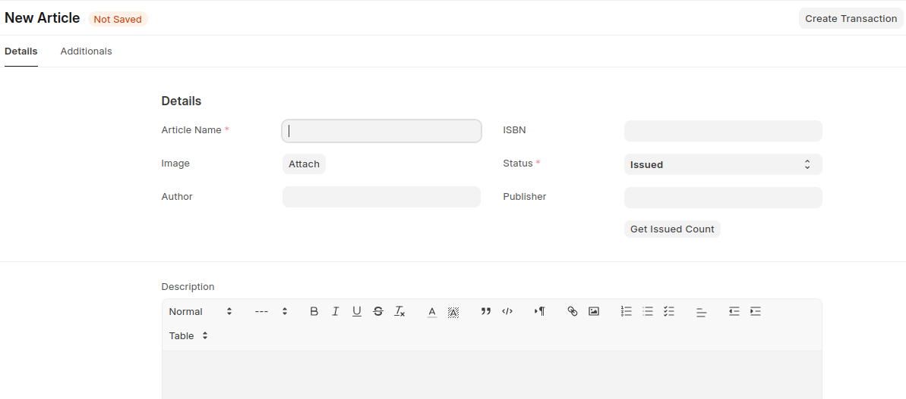
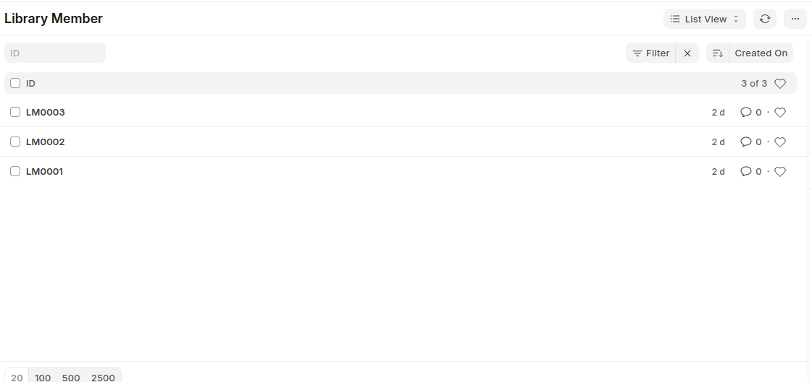
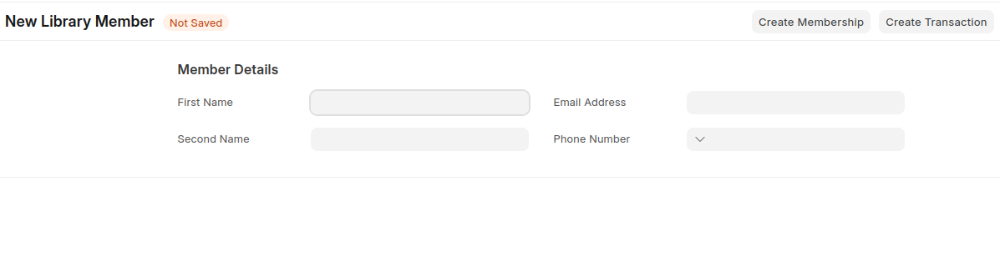
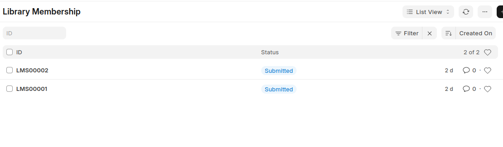
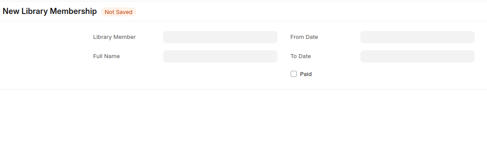
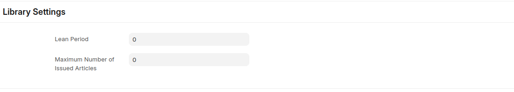
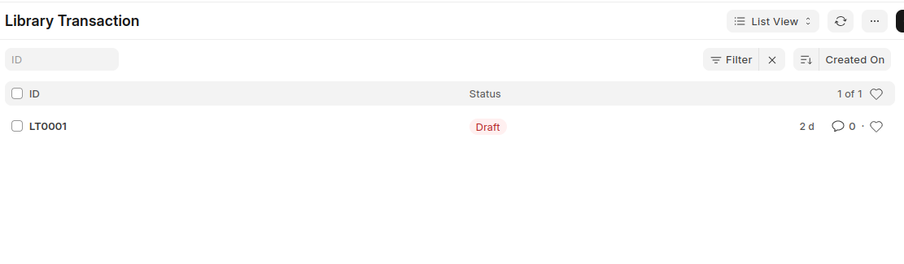
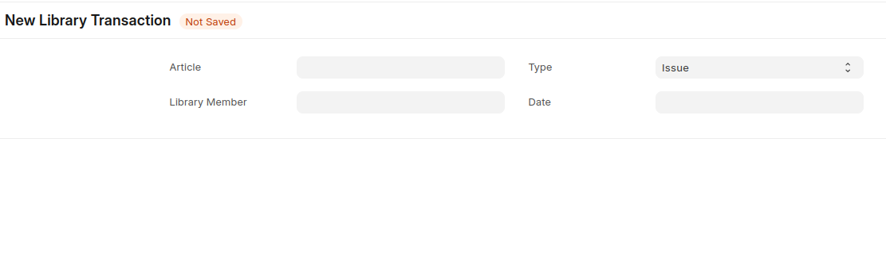

### Library Management Web Application

This is a simple web application built using the Frappe Framework to help a local library manage its books, members, and transactions. The application supports CRUD operations for books and members, issuing and returning books.

### Features

#### Books Management

- Add, view, edit, and delete books.
- Track the stock of books.

#### Members Management

- Add, view, edit, and delete members.

#### Transactions

- Issue books to members.
- Record book returns 


### Doctypes Involved
- **Article:** For managing books and stock.
- **Library Member:** For maintaining member records.
- **Library Membership:** To track the membership history of each member.
- **Library Settings:** The General setting and limits of a library transactions
- **Library Transaction:** For recording the issue and return of books.

### Technology Stack
- **Backend:** Python with the Frappe Framework
- **Database:** MariaDB
- **API:** RESTful API provided by Frappe for CRUD operations

### Setup Instructions

#### Prerequisites
Ensure you have the following installed:

- Python 3.x
- Node.js
- Redis
- MariaDB
- Yarn
- Frappe Bench

#### Installation Steps
1. Clone this repository
```bash     
git clone https://github.com/mikeyolang/library_management_system
cd library_management

 ```
2. Install Frappe and Create a Site

```bash     
bench init frappe-bench
 ```

3. Install the Library Management App
```bash
bench get-app library_management https://github.com/mikeyolang/library_management_system
bench --site library.local install-app library_management

```
4. Start the Bench
```bash
bench start
```
5. Access the Application
    - Open your browser and navigate to[ http://localhost:8000.](http://library.localhost:8000/)

### How to Use

1. **Add a Book:** Navigate to the Books page and click on “Add Book”. Enter the book details (Title, Author, Stock) and save.
2. **Add a Member:** Navigate to the Members page and click on “Add Member”. Enter the member's name and save.
3. **Issue a Book:** Go to the Transactions page and select a book and a member. Enter the issue date and save.
4. **Return a Book:** Find the issued transaction and add a return date. The app will calculate the fees automatically.

### Screenshots
#### Here is the General Workspace:


#### Here are the Various Doc Type Screenshots
1. Article
 


2. Library Member



3. Library Membership



4. Library Settings



5. Library Transactions


